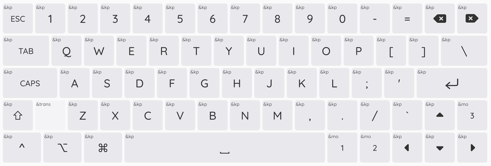

# zmk-config
ZMK firmware config for PolarityWorks BT60 v2 in ANSI 1u layout.

# Layout

The default layout of the keyboard is shown above. Note a few differences to other ANSI 60% layouts:

* Modifier keys for additional layers <kbd>M1</kbd> (Fn/Function), <kbd>M2</kbd> (Media), and <kbd>M3</kbd> (Bluetooth) in bottom right corner
* <kbd>Backspace</kbd> and <kbd>Delete</kbd> in top right corner
* Backtick/Tilde key is in the bottom right, next to <kbd>↑</kbd>

Additional Layers:

* `Function Layer`: Hold modifier key <kbd>M1</kbd> to map top row keys <kbd>1</kbd>, <kbd>2</kbd>, ..., <kbd>=</kbd> to function keys <kbd>F1</kbd>, <kbd>F2</kbd>, ..., <kbd>F12</kbd>.
* `Media Layer`: Hold modifier key <kbd>M2</kbd> to map top row keys <kbd>7</kbd>, <kbd>8</kbd>, ..., <kbd>=</kbd> to media keys <kbd>Prev</kbd>, <kbd>Play/Pause</kbd>, <kbd>Next</kbd>, <kbd>Mute</kbd>, <kbd>Volume Down</kbd>, <kbd>Volume Up</kbd>.
* `Bluetooth Layer`: Hold modifier key <kbd>M3</kbd> to map top row keys <kbd>1</kbd>, <kbd>2</kbd>, <kbd>3</kbd> to Bluetooth channels/profiles 1-3. Also maps 
<kbd>Backspace</kbd> and <kbd>Delete</kbd> to `Clear current profile` and `Clear all profiles`.

# Combos
There are a few combos available for special behavior. All of them require a one second press and use the third modifier key <kbd>M3</kbd> (Bluetooth layer):

* <kbd>M3</kbd> + <kbd>^</kbd> + <kbd>⌥</kbd> + <kbd>⌘</kbd>: Put keyboard in bootloader mode, allowing to flash new firmware
* <kbd>M3</kbd> + <kbd>Esc</kbd>: Soft off behavior
* <kbd>M3</kbd> + <kbd>^</kbd>: Resets keyboard and reruns firmware flashed to the device

